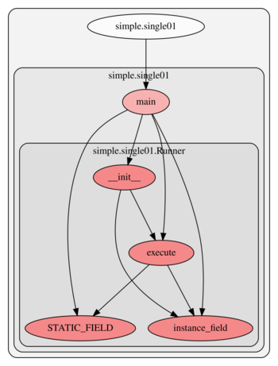
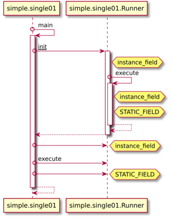

# pyastgraph

Generate use graph from static Python code. Project is inspired by [pyan](https://github.com/Technologicat/pyan). 
Long term goal is to help analyze multithreaded code, especially identifying potential critical sections.

Features:
- use graph including modules, classes, methods and fields using dot engine
- sequence graph (based on types instead of instances) using PlantUML
- filtering of items


## Examples

Following example demonstrates diagrams representation of code from file `examples/simple/single01.py`:

[](examples/simple/out/single01.png)
[](examples/simple/out/single01.plantuml.png)

Given diagrams were generated from following source code:

<!-- insertstart include="examples/simple/single01.py" pre="\n\n```\n" post="```\n\n" -->

```
class Runner:

    STATIC_FIELD = "initial_value"

    def __init__(self):
        self.instance_field = []
        self.execute()

    def execute(self):
        print("executing", self.instance_field)
        self.STATIC_FIELD = "new_value"


def main():
    runner = Runner()
    runner.instance_field = ["aaa"]
    runner.execute()
    Runner.STATIC_FIELD = "main_value"


if __name__ == "__main__":
    main()
```

<!-- insertend -->


Other examples:
- [filter down from `execute` method](examples/simple/out/single01_filter_down.svg)
- [filter up from `execute` method](examples/simple/out/single01_filter_up.svg)
- [multifile](examples/multifile01/out/multifile.svg)
- [slightly bigger example (this project) - use](examples/astgraph/out/astgraph.svg)
- [slightly bigger example (this project) - sequence](examples/astgraph/out/astgraph.plantuml.svg)


## Running application

To run application execute `python3 -m astgraph --help` to receive [cmd help](doc/cmdargs.md).

Presented example was generated using following command:

```
python3 -m astgraph -f ./examples/simple/single01.py \
                    --outsvgfile "./examples/simple/out/single01.svg" \
                    --outdotfile "./examples/simple/out/single01.dot.txt" \
                    --outseqdiag "./examples/simple/out/single01.plantuml" \
                    --outseqsvg "./examples/simple/out/single01.plantuml.svg" \
```


## Installation

Installation of package can be done by:
 - to install package from downloaded ZIP file execute: `pip3 install --user -I file:pyastgraph-master.zip#subdirectory=src`
 - to install package directly from GitHub execute: `pip3 install --user -I git+https://github.com/anetczuk/pyastgraph.git#subdirectory=src`
 - uninstall: `pip3 uninstall pyastgraph`

Installation For development:
 - `install-deps.sh` to install package dependencies only (`requirements.txt`)
 - `install-package.sh` to install package in standard way through `pip` (with dependencies)
 - `install-package-dev.sh` to install package in developer mode using `pip` (with dependencies)


## Development

All tests and content generators can be executed by simple script `./process-all.sh`.

Unit tests are executed by `./src/testastgraph/runtests.py`.

Code linters can be run by `./tools/checkall.sh`.


## Similar projects

- [pyan](https://github.com/Technologicat/pyan)
- [python-graphs](https://github.com/google-research/python-graphs)


## References

- [Python AST](https://earthly.dev/blog/python-ast/)
- [Python AST for linters](https://deepsource.com/blog/python-asts-by-building-your-own-linter)
- [PlantUML](https://plantuml.com/)


## License

Copyright (c) 2024, Arkadiusz Netczuk <dev.arnet@gmail.com>
All rights reserved.

This source code is licensed under the GNU GENERAL PUBLIC LICENSE, Version 2, June 1991, found in the
LICENSE file in the root directory of this source tree.
